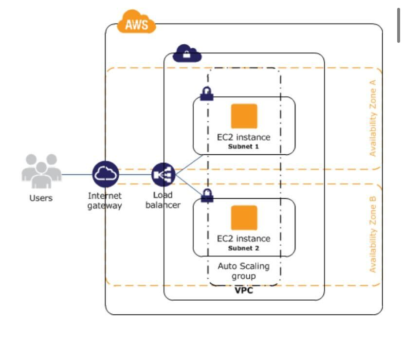

# Sample Web-App highly availabile Architecture

## Architecture

## Resources to be created

The terraform scripts will create a sample architecture template for hosting monolith web application. The list of resources to be created can be found below.

- VPC - CIDR = [10.0.0.0/16]
- Private subnets
  - private-subnet-1 [10.0.1.0/24]
  - private-subnet-2 [10.0.2.0/24]
- Public subnet
  - pubic-subnet-1 [10.0.3.0/24]
- Internet gateway
- Security Groups
  - sg-web-instances: allow ingress traffic on 80 from load-balancer 
  - sg-internet-gateway: 
  - sg-load-balancer: allow ingress traffic from 0.0.0.0/0 on 80
- EC2 instances - (web-app)
  - count-2 in 2 AZs
  - map sg-web-instances
- Auto-scaling group
- Application Load Balancer
- Route table
  - routes